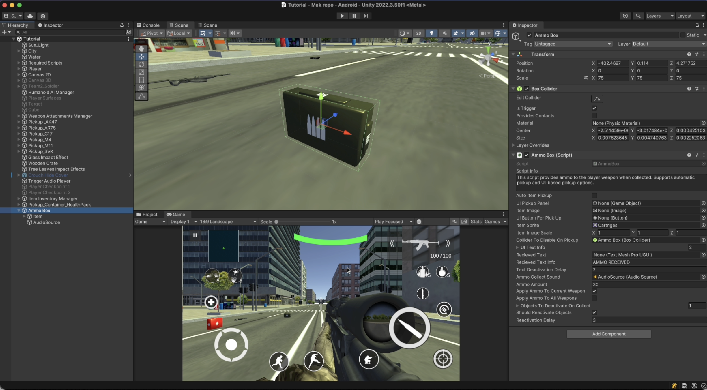
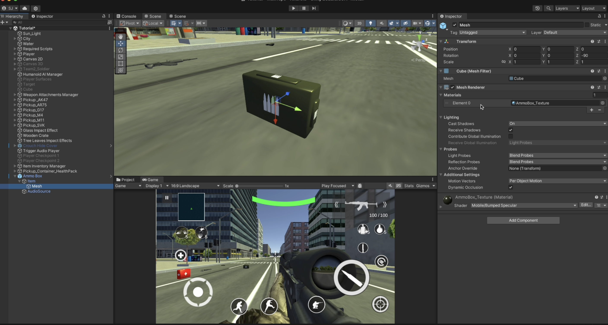
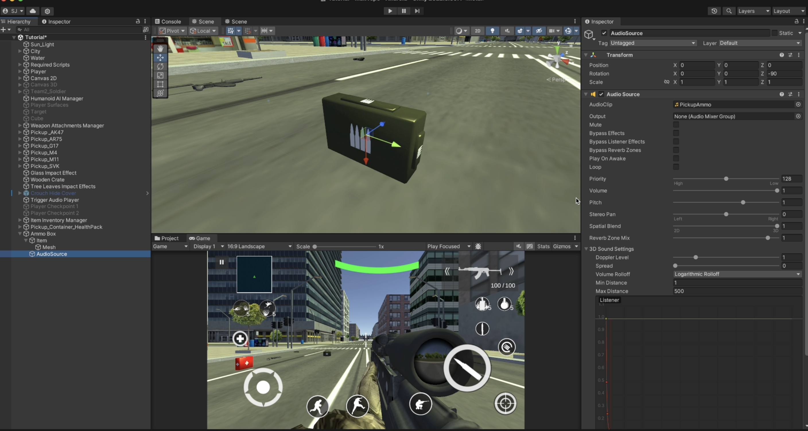
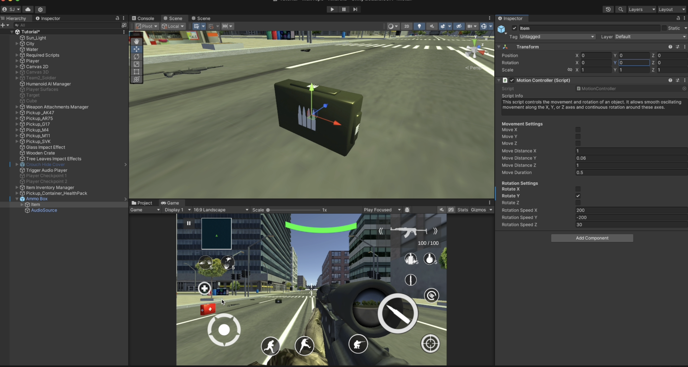

# HealthPack Pickup

    <iframe width="700" height="405" src="https://www.youtube.com/embed/hVD0wtHb4UM?si=PUNwfF04UUhETk_2" title="YouTube video player" frameborder="0" allow="accelerometer; autoplay; clipboard-write; encrypted-media; gyroscope; picture-in-picture; web-share" referrerpolicy="strict-origin-when-cross-origin" allowfullscreen></iframe>

## Introduction
This video will guide you on how to setup 'AmmoBox' pickup for the player.

### AmmoBox
First,you need to setup the structure like shown in the video above [See the image below].
Make sure to add the Box collider component and check Is Trigger checkbox. You also need to add a script called 'AmmoBox'. 

<table class="custom-table">
<tr>
<th>Fields</th>
<th>Info</th>
</tr>
<tr>
<td>AutoItemPickup</td>
<td>If enabled, the ammo box will be picked up automatically when the player collides with it.</td>
</tr>
<tr>
<td>UIPickupPanel</td>
<td>A UI panel that appears when the player is near the ammo box, showing pickup options.</td>
</tr>
<tr>
<td>ItemImage</td>
<td>UI Image displaying the ammo box sprite.</td>
</tr>
<tr>
<td>UIButtonForPickUp</td>
<td>Button to confirm ammo pickup when UI panel is active.</td>
</tr>
<tr>
<td>ItemSprite</td>
<td>The sprite representing the ammo box in the UI.</td>
</tr>
<tr>
<td>ItemImageScale</td>
<td>The scale of the item image in the UI.</td>
</tr>
<tr>
<td>ColliderToDisableOnPickup</td>
<td>Collider that will be disabled once the ammo box is collected.</td>
</tr>
<tr>
<td>UITextInfo</td>
<td>List of UI text elements associated with the ammo box.</td>
</tr>
<tr>
<td>RecievedText</td>
<td>Text displayed when the player receives ammo.</td>
</tr>
<tr>
<td>RecievedTextInfo</td>
<td>The message to display when ammo is picked up.</td>
</tr>
<tr>
<td>TextDeactivationDelay</td>
<td>Duration before the received text disappears.</td>
</tr>
<tr>
<td>AmmoCollectSound</td>
<td>Sound effect played when the player collects the ammo box.</td>
</tr>
<tr>
<td>AmmoAmount</td>
<td>Amount of ammo given when the player picks up the box.</td>
</tr>
<tr>
<td>ApplyAmmoToCurrentWeapon</td>
<td>If enabled, adds ammo only to the currently equipped weapon.</td>
</tr>
<tr>
<td>ApplyAmmoToAllWeapons</td>
<td>If enabled, distributes ammo across all weapons in the player's inventory.</td>
</tr>
<tr>
<td>ObjectsToDeactivateOnCollect</td>
<td>Objects to deactivate when the ammo box is picked up.</td>
</tr>
<tr>
<td>ShouldReactivateObjects</td>
<td>If enabled, deactivated objects will reactivate after a delay.</td>
</tr>
<tr>
<td>ReactivationDelay</td>
<td>Delay before reactivating objects that were deactivated upon pickup.</td>
</tr>
</table>

### Motion Controller
This script controls the movement and rotation of an object. It allows smooth oscillating movement along the X, Y, or Z axes and continuous rotation around these axes.

<table class="custom-table">
<tr>
<th>Fields</th>
<th>Info</th>
</tr>
<tr>
<td>moveX</td>
<td>Enable or disable movement along the X-axis.</td>
</tr>
<tr>
<td>moveY</td>
<td>Enable or disable movement along the Y-axis.</td>
</tr>
<tr>
<td>moveZ</td>
<td>Enable or disable movement along the Z-axis.</td>
</tr>
<tr>
<td>moveDistanceX</td>
<td>Distance to move along the X-axis.</td>
</tr>
<tr>
<td>moveDistanceY</td>
<td>Distance to move along the Y-axis.</td>
</tr>
<tr>
<td>moveDistanceZ</td>
<td>Distance to move along the Z-axis.</td>
</tr>
<tr>
<td>moveDuration</td>
<td>Duration for one complete movement cycle.</td>
</tr>
<tr>
<td>rotateX</td>
<td>Enable or disable rotation around the X-axis.</td>
</tr>
<tr>
<td>rotateY</td>
<td>Enable or disable rotation around the Y-axis.</td>
</tr>
<tr>
<td>rotateZ</td>
<td>Enable or disable rotation around the Z-axis.</td>
</tr>
<tr>
<td>rotationSpeedX</td>
<td>Rotation speed around the X-axis (degrees per second).</td>
</tr>
<tr>
<td>rotationSpeedY</td>
<td>Rotation speed around the Y-axis (degrees per second).</td>
</tr>
<tr>
<td>rotationSpeedZ</td>
<td>Rotation speed around the Z-axis (degrees per second).</td>
</tr>
</table>
