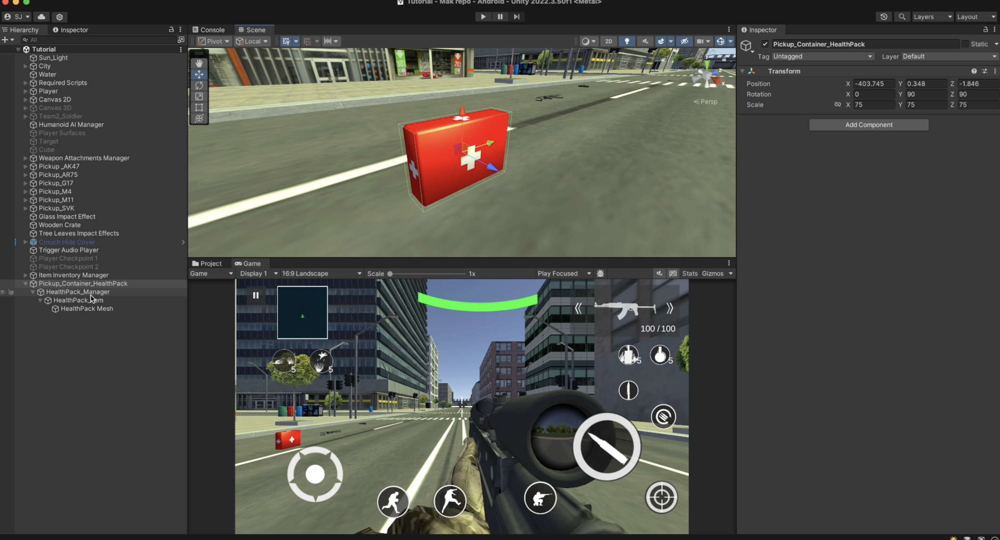
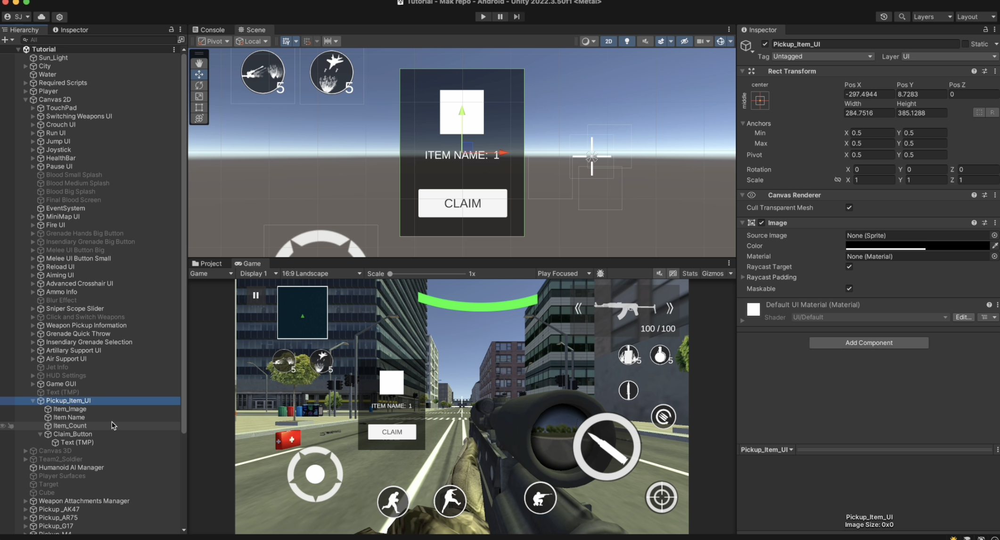
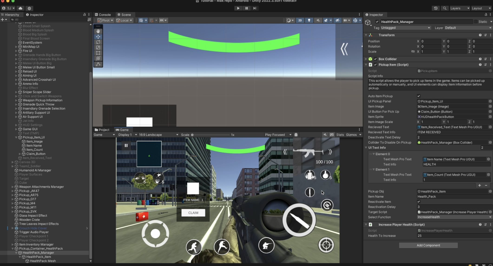
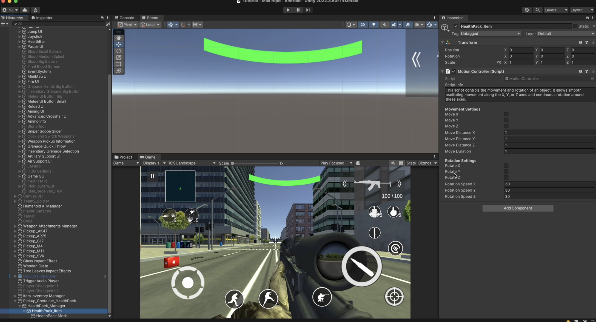
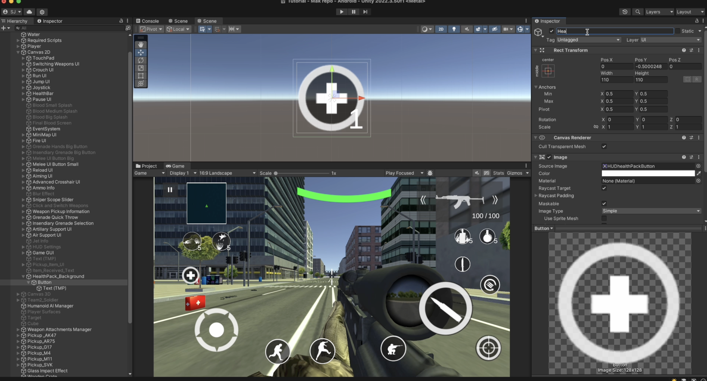
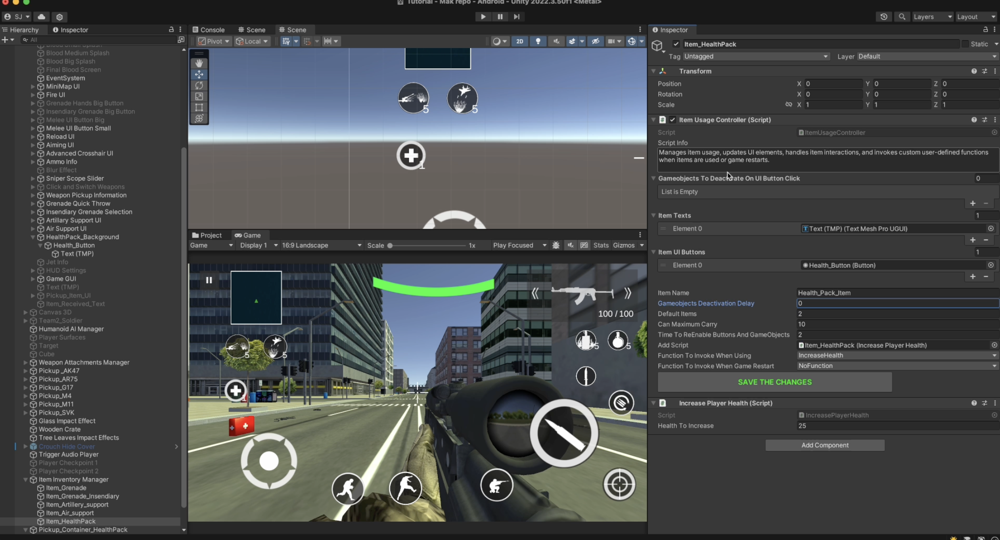
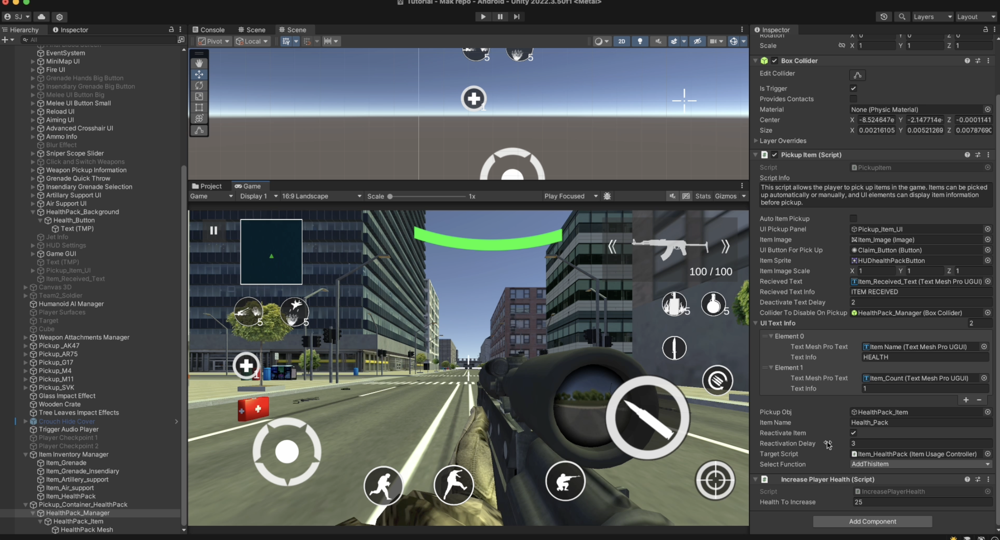
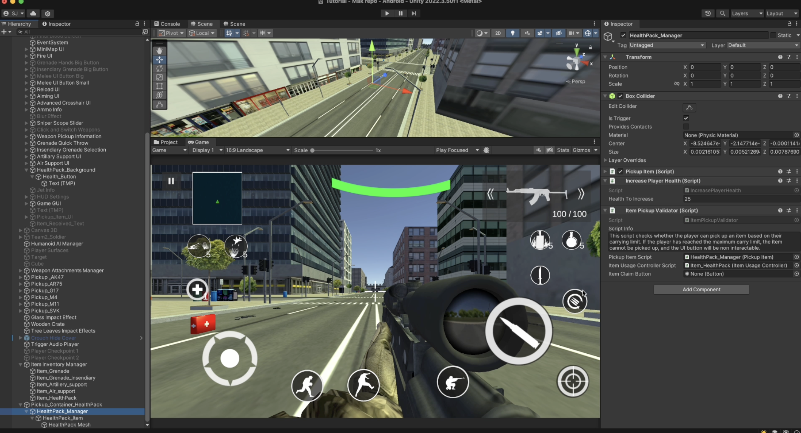

# HealthPack Pickup

    <iframe width="700" height="405" src="https://www.youtube.com/embed/hVD0wtHb4UM?si=PUNwfF04UUhETk_2" title="YouTube video player" frameborder="0" allow="accelerometer; autoplay; clipboard-write; encrypted-media; gyroscope; picture-in-picture; web-share" referrerpolicy="strict-origin-when-cross-origin" allowfullscreen></iframe>

## Introduction
This video will help you understand how to setup healthpack pickup for the player.

### Setting up the HealthPack
First,you need to setup the structure like shown in the video above[See the image below].

Add a 'Box Collider' component to the 'HealthPack Manager' gameObject and add a script called 'Pickup Item'.[See the image below].

After this setup the pickup Item UI like shown in the video above[See the image below].

### Pickup Item
This script allows the player to pick up items in the game. Items can be picked up automatically or manually, and UI elements can display item information before pickup.

<table class="custom-table">
<tr>
<th>Fields</th>
<th>Info</th>
</tr>
<tr>
<td>AutoItemPickup</td>
<td>Picks the item automatically on player collision.</td>
</tr>
<tr>
<td>UIPickupPanel</td>
<td>A UI Panel to show the item information before picking it up.</td>
</tr>
<tr>
<td>ItemImage</td>
<td>The image UI element to display the item sprite.</td>
</tr>
<tr>
<td>UIButtonForPickUp</td>
<td>The button that allows manual item pickup when clicked.</td>
</tr>
<tr>
<td>ItemSprite</td>
<td>The sprite representing the item in the UI.</td>
</tr>
<tr>
<td>ItemImageScale</td>
<td>The scale of the item image in the UI panel.</td>
</tr>
<tr>
<td>RecievedText</td>
<td>Text UI element to display 'Item Received' notification.</td>
</tr>
<tr>
<td>RecievedTextInfo</td>
<td>The text displayed when an item is received.</td>
</tr>
<tr>
<td>DeactivateTextDelay</td>
<td>Time in seconds before hiding the received text notification.</td>
</tr>
<tr>
<td>ColliderToDisableOnPickup</td>
<td>The collider that gets disabled when the item is picked up.</td>
</tr>
<tr>
<td>UITextInfo</td>
<td>A list of UI texts to display additional information about the item.</td>
</tr>
<tr>
<td>PickupObj</td>
<td>The item object that will be picked up and deactivated upon collection.</td>
</tr>
<tr>
<td>ItemName</td>
<td>The name of the item being picked up.</td>
</tr>
<tr>
<td>ReactivateItem</td>
<td>If enabled, the item will respawn after a delay once picked up.</td>
</tr>
<tr>
<td>ReactivationDelay</td>
<td>Time in seconds before the item respawns if ReactivateItem is enabled.</td>
</tr>
<tr>
<td>TargetScript</td>
<td>The target script that will execute a specific function upon pickup.</td>
</tr>
</table>

### Motion Controller
This script controls the movement and rotation of an object. It allows smooth oscillating movement along the X, Y, or Z axes and continuous rotation around these axes.

<table class="custom-table">
<tr>
<th>Fields</th>
<th>Info</th>
</tr>
<tr>
<td>moveX</td>
<td>Enable or disable movement along the X-axis.</td>
</tr>
<tr>
<td>moveY</td>
<td>Enable or disable movement along the Y-axis.</td>
</tr>
<tr>
<td>moveZ</td>
<td>Enable or disable movement along the Z-axis.</td>
</tr>
<tr>
<td>moveDistanceX</td>
<td>Distance to move along the X-axis.</td>
</tr>
<tr>
<td>moveDistanceY</td>
<td>Distance to move along the Y-axis.</td>
</tr>
<tr>
<td>moveDistanceZ</td>
<td>Distance to move along the Z-axis.</td>
</tr>
<tr>
<td>moveDuration</td>
<td>Duration for one complete movement cycle.</td>
</tr>
<tr>
<td>rotateX</td>
<td>Enable or disable rotation around the X-axis.</td>
</tr>
<tr>
<td>rotateY</td>
<td>Enable or disable rotation around the Y-axis.</td>
</tr>
<tr>
<td>rotateZ</td>
<td>Enable or disable rotation around the Z-axis.</td>
</tr>
<tr>
<td>rotationSpeedX</td>
<td>Rotation speed around the X-axis (degrees per second).</td>
</tr>
<tr>
<td>rotationSpeedY</td>
<td>Rotation speed around the Y-axis (degrees per second).</td>
</tr>
<tr>
<td>rotationSpeedZ</td>
<td>Rotation speed around the Z-axis (degrees per second).</td>
</tr>
</table>

### Health UI Button
Create the Health UI Button in Canvas 2D like shown in the video above. Your setup will look like this [See the screenshot]

Drag and drop the 'ItemUsageController' scipt and choose the functon 'AddThisItem'.[See the screenshot]

### Item Pickup Validator
This script checks whether the player can pick up an item based on their carrying limit. If the player has reached the maximum carry limit, the item cannot be picked up, and the UI button will be non interactable.

<table class="custom-table">
<tr>
<th>Fields</th>
<th>Info</th>
</tr>
<tr>
<td>PickupItemScript</td>
<td>Reference to the PickupItem script controlling the pickup behavior.</td>
</tr>
<tr>
<td>ItemUsageControllerScript</td>
<td>Reference to the ItemUsageController script that tracks currently carried items.</td>
</tr>
<tr>
<td>ItemClaimButton</td>
<td>The UI button that allows the player to claim the item.</td>
</tr>
</table>
