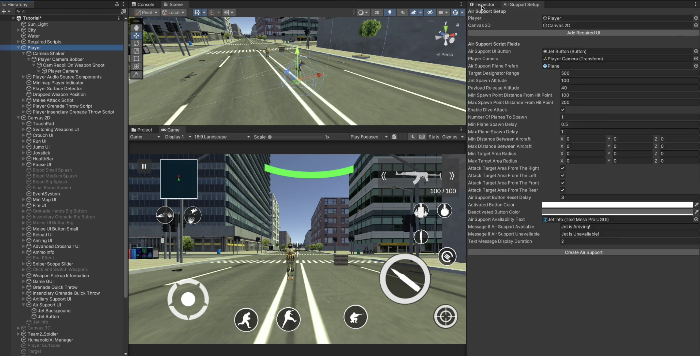
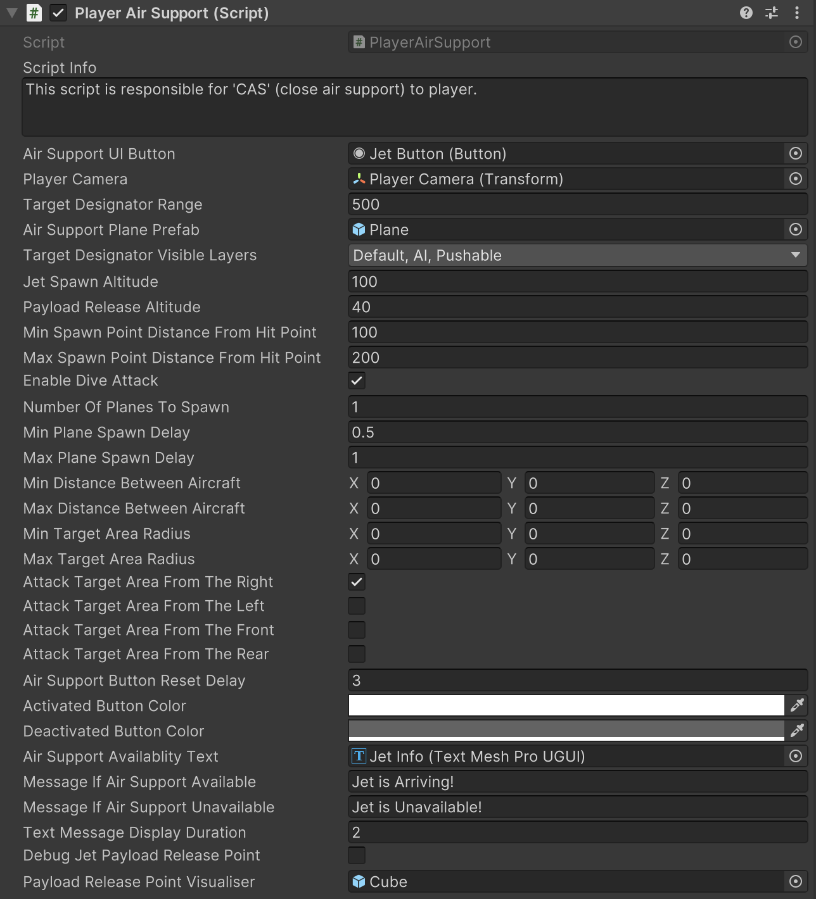

# Air Support

    <iframe width="700" height="405" src="https://www.youtube.com/embed/hVD0wtHb4UM?si=PUNwfF04UUhETk_2" title="YouTube video player" frameborder="0" allow="accelerometer; autoplay; clipboard-write; encrypted-media; gyroscope; picture-in-picture; web-share" referrerpolicy="strict-origin-when-cross-origin" allowfullscreen></iframe>

## Introduction
This video will guide you on how to setup the air support for the player.

### Player Air Support Setup
Go to Tools < Mobile Action Kit < Player < Player < Create Air Support and assign the necessary gameObjects and components like shown in the video above. Your setup should look like this [See the image below].

### Player Air Support Script
This script is responsible for 'CAS' (close air support) to player.

<table class="custom-table">
<tr>
<th>Fields</th>
<th>Info</th>
</tr>
<tr>
<td>AirSupportUIButton</td>
<td>Drag and drop the UI button from the hierarchy into this field.</td>
</tr>
<tr>
<td>PlayerCamera</td>
<td>Drag and drop player camera from player's hierarchy into this field.</td>
</tr>
<tr>
<td>TargetDesignatorRange</td>
<td>Range within which player can designate the target for close air support.</td>
</tr>
<tr>
<td>AirSupportPlanePrefab</td>
<td>Drag and drop the Jet prefab from the project into this field.</td>
</tr>
<tr>
<td>TargetDesignatorVisibleLayers</td>
<td>Specify the visible layers for raycasting.</td>
</tr>
<tr>
<td>JetSpawnAltitude</td>
<td>Air support spawn altitude from target point surface.</td>
</tr>
<tr>
<td>PayloadReleaseAltitude</td>
<td>Payload release altitude from target point surface.</td>
</tr>
<tr>
<td>MinSpawnPointDistanceFromHitPoint</td>
<td>Minimum distance from the target point at which the plane can be spawned.</td>
</tr>
<tr>
<td>MaxSpawnPointDistanceFromHitPoint</td>
<td>Maximum distance from the target point at which the plane can be spawned.</td>
</tr>
<tr>
<td>EnableDiveAttack</td>
<td>If checked, the plane will rotate on both X and Y axes to look at the target point until it reaches there. If unchecked, it will only rotate on the Y axis.</td>
</tr>
<tr>
<td>NumberOfPlanesToSpawn</td>
<td>Enter the number of planes to spawn.</td>
</tr>
<tr>
<td>MinPlaneSpawnDelay</td>
<td>Minimum delay before spawning the plane.</td>
</tr>
<tr>
<td>MaxPlaneSpawnDelay</td>
<td>Maximum delay before spawning the plane.</td>
</tr>
<tr>
<td>MinDistanceBetweenAircraft</td>
<td>If more than one plane is spawned, this specifies the minimum distance between them.</td>
</tr>
<tr>
<td>MaxDistanceBetweenAircraft</td>
<td>If more than one plane is spawned, this specifies the maximum distance between them.</td>
</tr>
<tr>
<td>MinTargetAreaRadius</td>
<td>If multiple planes are spawned, this sets the minimum offset from the target area to prevent collisions.</td>
</tr>
<tr>
<td>MaxTargetAreaRadius</td>
<td>If multiple planes are spawned, this sets the maximum offset from the target area to prevent collisions.</td>
</tr>
<tr>
<td>AttackTargetAreaFromTheRight</td>
<td>If checked, the plane will spawn from the right side of the player camera view.</td>
</tr>
<tr>
<td>AttackTargetAreaFromTheLeft</td>
<td>If checked, the plane will spawn from the left side of the player camera view.</td>
</tr>
<tr>
<td>AttackTargetAreaFromTheFront</td>
<td>If checked, the plane will spawn from the front side of the player camera view.</td>
</tr>
<tr>
<td>AttackTargetAreaFromTheRear</td>
<td>If checked, the plane will spawn from the rear side of the player camera view.</td>
</tr>
<tr>
<td>AirSupportButtonResetDelay</td>
<td>Duration (in seconds) before the UI button becomes interactable again after using air support.</td>
</tr>
<tr>
<td>ActivatedButtonColor</td>
<td>Specify the color of the UI button when it is interactable.</td>
</tr>
<tr>
<td>DeactivatedButtonColor</td>
<td>Specify the color of the UI button when it is not interactable.</td>
</tr>
<tr>
<td>AirSupportAvailablityText</td>
<td>Drag and drop a 'TextMeshPro' text component from the hierarchy into this field to display the message of air support availability.</td>
</tr>
<tr>
<td>MessageIfAirSupportAvailable</td>
<td>Enter the message to display when air support is available.</td>
</tr>
<tr>
<td>MessageIfAirSupportUnavailable</td>
<td>Enter the message to display when air support is unavailable.</td>
</tr>
<tr>
<td>TextMessageDisplayDuration</td>
<td>Specify the duration (in seconds) for which the message will be displayed.</td>
</tr>
</table>

