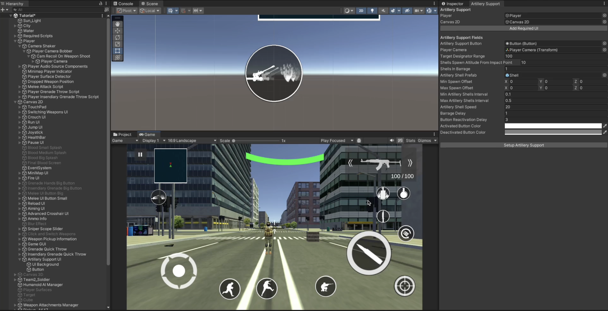
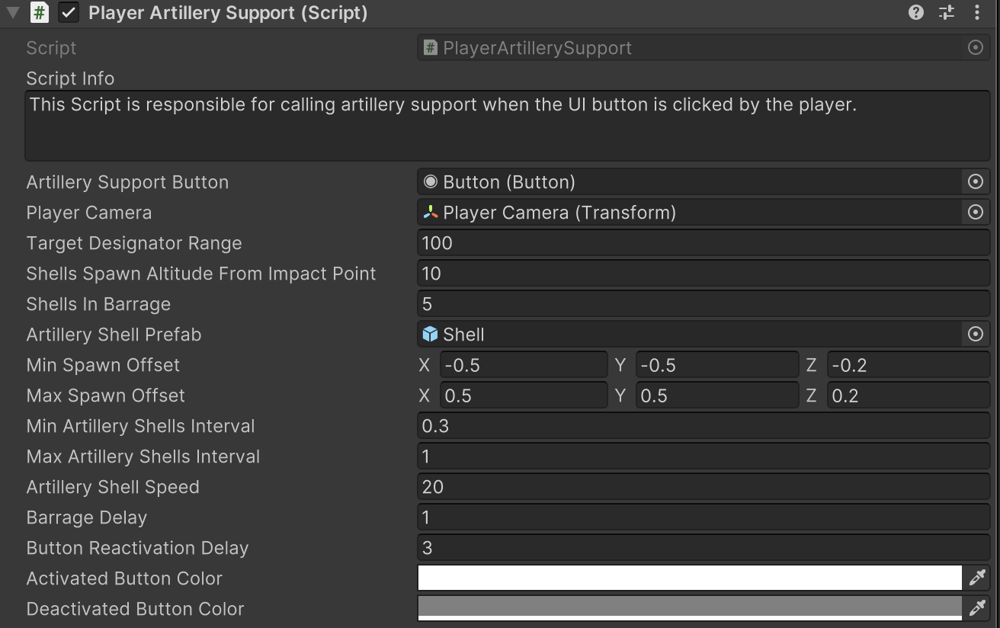

# Artillery Support

    <iframe width="700" height="405" src="https://www.youtube.com/embed/hVD0wtHb4UM?si=PUNwfF04UUhETk_2" title="YouTube video player" frameborder="0" allow="accelerometer; autoplay; clipboard-write; encrypted-media; gyroscope; picture-in-picture; web-share" referrerpolicy="strict-origin-when-cross-origin" allowfullscreen></iframe>

## Introduction
This video will guide you on how to setup the artillery support for the player.

### Player Artillery Support Setup
Go to Tools < Mobile Action Kit < Player < Player < Create Artillery Support and assign the necessary gameObjects and components like shown in the video above. Your setup should look like this [See the image below].

### Player Artillery Support Script
This Script is responsible for calling artillery support when the UI button is clicked by the player.

<table class="custom-table">
<tr>
<th>Fields</th>
<th>Info</th>
</tr>
<tr>
<td>ArtillerySupportButton</td>
<td>Drag and drop the UI button from the hierarchy into this field.</td>
</tr>
<tr>
<td>PlayerCamera</td>
<td>Drag and drop the player's camera attached to the player hierarchy into this field.</td>
</tr>
<tr>
<td>TargetDesignatorRange</td>
<td>Range within which the player can designate the target for artillery support.</td>
</tr>
<tr>
<td>ShellsSpawnAltitudeFromImpactPoint</td>
<td>Artillery shells spawn altitude above the target point surface.</td>
</tr>
<tr>
<td>ShellsInBarrage</td>
<td>Number of artillery shells in a barrage.</td>
</tr>
<tr>
<td>ArtilleryShellPrefab</td>
<td>Drag and drop the explosive prefab from the project into this field.</td>
</tr>
<tr>
<td>MinSpawnOffset</td>
<td>Minimal positional offset from the target point between falling artillery shells.</td>
</tr>
<tr>
<td>MaxSpawnOffset</td>
<td>Maximal positional offset from the target point between falling artillery shells.</td>
</tr>
<tr>
<td>MinArtilleryShellsInterval</td>
<td>Minimal time interval between falling shells.</td>
</tr>
<tr>
<td>MaxArtilleryShellsInterval</td>
<td>Maximal time interval between falling shells.</td>
</tr>
<tr>
<td>ArtilleryShellSpeed</td>
<td>Speed of incoming artillery shells.</td>
</tr>
<tr>
<td>BarrageDelay</td>
<td>Delay before the barrage starts.</td>
</tr>
<tr>
<td>ButtonReactivationDelay</td>
<td>Artillery support button reactivation time since previous use.</td>
</tr>
<tr>
<td>ActivatedButtonColor</td>
<td>Specify the color of the UI button when it is interactable.</td>
</tr>
<tr>
<td>DeactivatedButtonColor</td>
<td>Specify the color of the UI button when it is not interactable.</td>
</tr>
</table>
