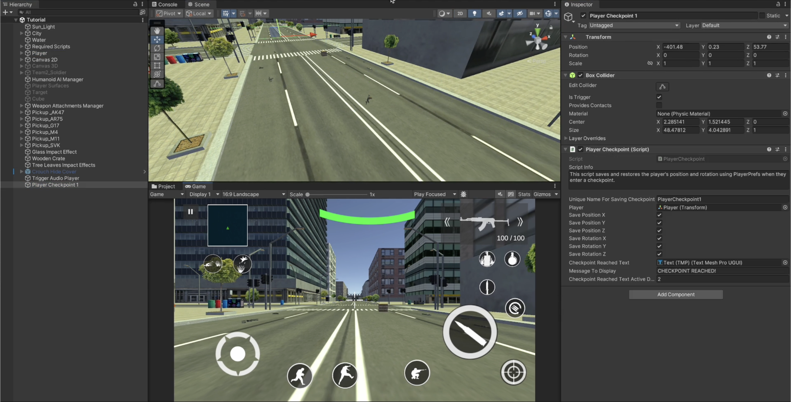
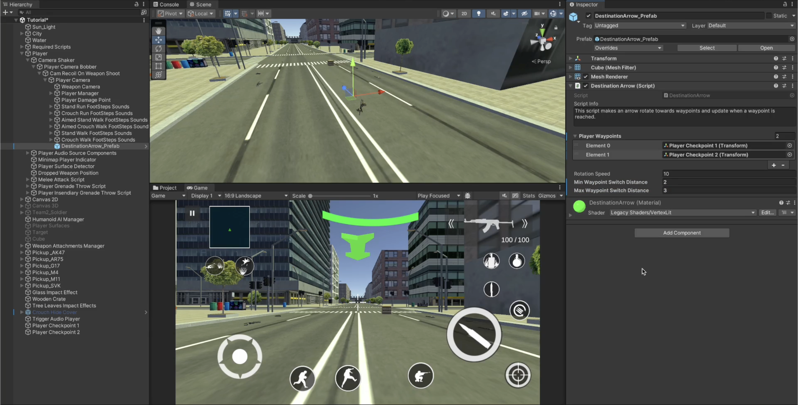

# Player Checkpoint System

    <iframe width="700" height="405" src="https://www.youtube.com/embed/hVD0wtHb4UM?si=PUNwfF04UUhETk_2" title="YouTube video player" frameborder="0" allow="accelerometer; autoplay; clipboard-write; encrypted-media; gyroscope; picture-in-picture; web-share" referrerpolicy="strict-origin-when-cross-origin" allowfullscreen></iframe>

## Introduction
This video will guide you on how to setup the player checkpoint system with a guided arrow.

### Create Player Checkpoint
Step 1: Create an empty gameObject
Step 2: Add a primitive collider i.e Box Collider
Step 3: Add component 'Player Checkpoint' to it.

Assign the necessary gameObjects and components like shown in the video above. Your setup should look like this [See the image below].

### Player Checkpoint
This script saves and restores the player's position and rotation using PlayerPrefs when they enter a checkpoint.

<table class="custom-table">
<tr>
<th>Fields</th>
<th>Info</th>
</tr>
<tr>
<td>UniqueNameForSavingCheckpoint</td>
<td>Unique key used to store and retrieve the player's checkpoint data in PlayerPrefs.</td>
</tr>
<tr>
<td>Player</td>
<td>Reference to the player's transform.</td>
</tr>
<tr>
<td>SavePositionX</td>
<td>Whether to save and load the player's X position.</td>
</tr>
<tr>
<td>SavePositionY</td>
<td>Whether to save and load the player's Y position.</td>
</tr>
<tr>
<td>SavePositionZ</td>
<td>Whether to save and load the player's Z position.</td>
</tr>
<tr>
<td>SaveRotationX</td>
<td>Whether to save and load the player's X rotation.</td>
</tr>
<tr>
<td>SaveRotationY</td>
<td>Whether to save and load the player's Y rotation.</td>
</tr>
<tr>
<td>SaveRotationZ</td>
<td>Whether to save and load the player's Z rotation.</td>
</tr>
<tr>
<td>CheckpointReachedText</td>
<td>Text element that displays a message when a checkpoint is reached.</td>
</tr>
<tr>
<td>MessageToDisplay</td>
<td>The message that will be shown when the checkpoint is reached.</td>
</tr>
<tr>
<td>CheckpointReachedTextActiveDuration</td>
<td>Duration (in seconds) for which the checkpoint reached message stays visible.</td>
</tr>
</table>

### Create Player Destination Arrow
You can drag and drop the prefab located in Mobile Action Kit < Art < Destination Pointing Arrow < DestinationArrow_Prefab and make it to be child of the Player camera. Your setup should look like this [See the Image]

### Destination Arrow
This script saves and restores the player's position and rotation using PlayerPrefs when they enter a checkpoint.

<table class="custom-table">
<tr>
<th>Fields</th>
<th>Info</th>
</tr>
<tr>
<td>PlayerWaypoints</td>
<td>List of waypoints the arrow will point towards.</td>
</tr>
<tr>
<td>RotationSpeed</td>
<td>Speed at which the arrow rotates towards the next waypoint.</td>
</tr>
<tr>
<td>MinWaypointSwitchDistance</td>
<td>Minimum distance to the waypoint before updating to the next one.</td>
</tr>
<tr>
<td>MaxWaypointSwitchDistance</td>
<td>Maximum distance to the waypoint before updating to the next one.</td>
</tr>
</table>
