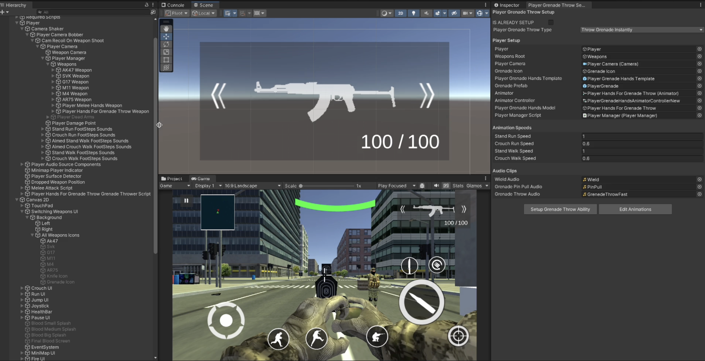
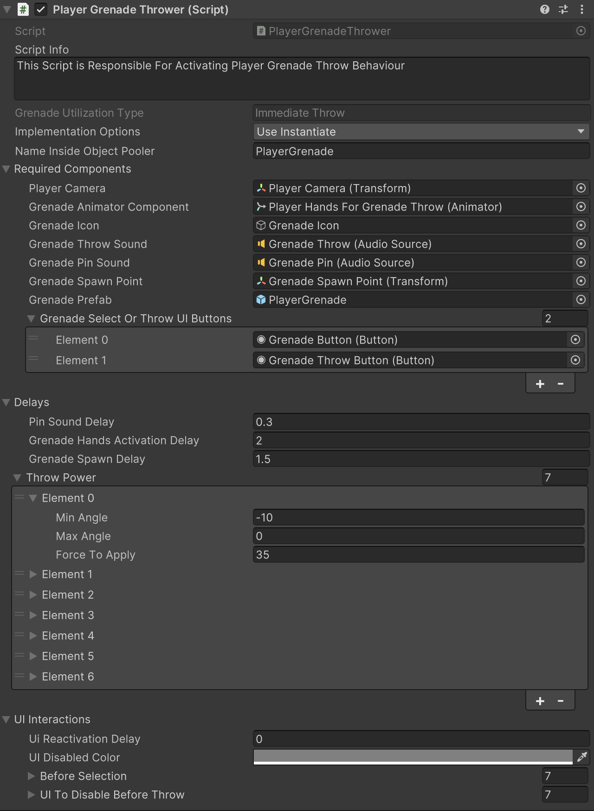

# Player Grenade Setup Part-2

    <iframe width="700" height="405" src="https://www.youtube.com/embed/hVD0wtHb4UM?si=PUNwfF04UUhETk_2" title="YouTube video player" frameborder="0" allow="accelerometer; autoplay; clipboard-write; encrypted-media; gyroscope; picture-in-picture; web-share" referrerpolicy="strict-origin-when-cross-origin" allowfullscreen></iframe>

## Introduction
This video will help you understand how to setup the player hands for throwing grenades.

### Player Grenade Holding Hands Setup
Go to Tools < Mobile Action Kit < Player < Grenade < Player Grenade Throw Setup and assign the necessary gameObjects and components like shown in the video above. Your setup should look like this [See the image below].

### Player Grenade Thrower Script
This script regulates various parameters of player`s grenade throwing functionality.

<table class="custom-table">
<tr>
<th>Fields</th>
<th>Info</th>
</tr>
<tr>
<td>GrenadeUtilizationType</td>
<td>Read-only. Type of grenade utilization, default is "Immediate Throw".</td>
</tr>
<tr>
<td>ImplementationOptions</td>
<td>Select one of the two implementation options for grenades: Instantiation or Object pooling.</td>
</tr>
<tr>
<td>NameInsideObjectPooler</td>
<td>This must be the exact same name as the one inside the Object Pooler.</td>
</tr>
<tr>
<td>KeepActive</td>
<td>Boolean field to keep the grenade system active.</td>
</tr>
<tr>
<td>DelayFirstThrowsOnly</td>
<td>Boolean field to delay only the first grenade throws.</td>
</tr>
<tr>
<td>PlayerCamera</td>
<td>Player camera from the hierarchy should be assigned to this field.</td>
</tr>
<tr>
<td>GrenadeAnimatorComponent</td>
<td>'GrenadeAnimations' GameObject with the respective Animator Controller from the player’s hierarchy should be assigned.</td>
</tr>
<tr>
<td>GrenadeIcon</td>
<td>'Grenade' UI Image (icon) from the 2D Canvas should be assigned.</td>
</tr>
<tr>
<td>GrenadeThrowSound</td>
<td>'GrenadeThrow' AudioSource, which is a child of 'PlayerAudioSourceComponents' GameObject in the player's hierarchy, should be assigned.</td>
</tr>
<tr>
<td>GrenadePinSound</td>
<td>'GrenadePin' AudioSource, which is a child of 'PlayerAudioSourceComponents' GameObject in the player's hierarchy, should be assigned.</td>
</tr>
<tr>
<td>GrenadeSpawnPoint</td>
<td>'GrenadeSpawnPoint' child GameObject from the player's hierarchy should be assigned.</td>
</tr>
<tr>
<td>GrenadePrefab</td>
<td>Grenade prefab from the project tab should be assigned.</td>
</tr>
<tr>
<td>GrenadeSelectOrThrowUIButtons</td>
<td>List of UI buttons for selecting or throwing the grenade.</td>
</tr>
<tr>
<td>RequiredComponents</td>
<td>All required components should be placed into their respective fields.</td>
</tr>
<tr>
<td>PinSoundDelay</td>
<td>Specify the delay for pin removal sound playback.</td>
</tr>
<tr>
<td>GrenadeHandsActivationDelay</td>
<td>Delay for activating player’s hands with grenade, regardless of the grenade utilization option (Immediate Throw or Selection).</td>
</tr>
<tr>
<td>GrenadeSpawnDelay</td>
<td>Specify the grenade prefab activation or instantiation delay to match the grenade throw animation.</td>
</tr>
<tr>
<td>MinAngle</td>
<td>Minimal possible angle for intended throw distance.</td>
</tr>
<tr>
<td>MaxAngle</td>
<td>Maximal possible angle for intended throw distance.</td>
</tr>
<tr>
<td>ForceToApply</td>
<td>Set the force to apply to the grenade prefab to achieve the desired throw distance.</td>
</tr>
<tr>
<td>ThrowPower</td>
<td>List of different throw ranges depending on the player's camera angle at the moment of the throw.</td>
</tr>
<tr>
<td>UiReactivationDelay</td>
<td>Delay before UI elements are reactivated.</td>
</tr>
<tr>
<td>UIDisabledColor</td>
<td>Color of the disabled UI image (e.g., Grey).</td>
</tr>
<tr>
<td>BeforeSelection</td>
<td>Specify UI elements to disable before the player’s hands with a grenade appear (if 'Selection' was chosen in the grenade creation wizard).</td>
</tr>
<tr>
<td>UIToDisableBeforeThrow</td>
<td>Specify UI elements to disable during the grenade throw process (if 'Immediate Throw' was chosen in the grenade creation wizard).</td>
</tr>
</table>
