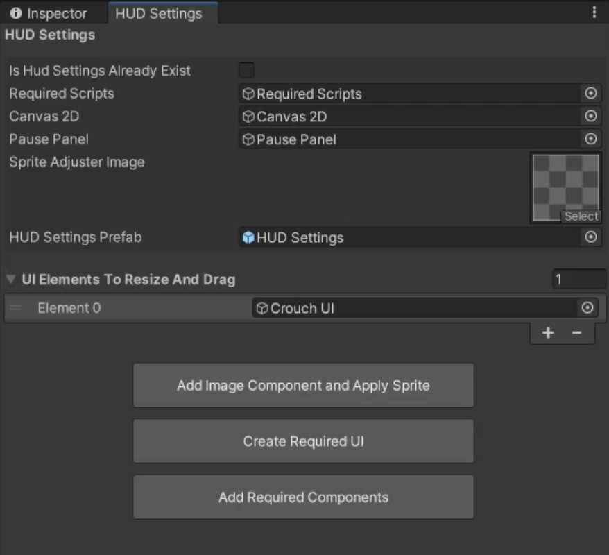

# Player HUD Settings

    <iframe width="700" height="405" src="https://www.youtube.com/embed/hVD0wtHb4UM?si=PUNwfF04UUhETk_2" title="YouTube video player" frameborder="0" allow="accelerometer; autoplay; clipboard-write; encrypted-media; gyroscope; picture-in-picture; web-share" referrerpolicy="strict-origin-when-cross-origin" allowfullscreen></iframe>

## Introduction
This video will guide you on how to setup the player HUD settings which allow to drag and resize player UI in runtime. Go to Tools < Mobile Action Kit < Player < Player < Create HUD Settings.

### Create HUD Settings
Assign the necessary gameObjects and components like shown in the video above. Your setup should look like this [See the image below].

Following the steps in the tutorial above you will find the HUD settings gameObject with a script component 'HUD Settings' added as well as 'Resize Image script' and 'Drag Image Script' added to the selected UI in wizard.

### HUD Settings
This script allows users to enable/disable resizing and dragging of UI elements in the game HUD.It also provides options to save, reset, and edit HUD settings.

<table class="custom-table">
<tr>
<th>Fields</th>
<th>Info</th>
</tr>
<tr>
<td>HudSettingsPanel</td>
<td>The main panel containing the HUD settings UI.</td>
</tr>
<tr>
<td>PausePanel</td>
<td>The pause menu panel that should be disabled when editing HUD settings.</td>
</tr>
<tr>
<td>HudActivatorButton</td>
<td>Button that opens the HUD settings panel.</td>
</tr>
<tr>
<td>DragButton</td>
<td>Button to enable dragging mode for UI elements.</td>
</tr>
<tr>
<td>ResizeButton</td>
<td>Button to enable resizing mode for UI elements.</td>
</tr>
<tr>
<td>SaveButton</td>
<td>Button to save the current HUD layout and settings.</td>
</tr>
<tr>
<td>ResetButton</td>
<td>Button to reset the HUD layout to default settings.</td>
</tr>
</table>

### Resize Image 
This script enables users to resize a UI image dynamically using touch or mouse drag. The size is saved and restored using PlayerPrefs, and default values are stored for resetting.

<table class="custom-table">
<tr>
<th>Fields</th>
<th>Info</th>
</tr>
<tr>
<td>UniqueNameToSaveResizing</td>
<td>Unique key to store and retrieve the resized dimensions in PlayerPrefs.</td>
</tr>
<tr>
<td>minSize</td>
<td>Minimum allowed size of the image.</td>
</tr>
<tr>
<td>maxSize</td>
<td>Maximum allowed size of the image.</td>
</tr>
</table>

### Drag Image 
This script enables dragging UI elements within a defined parent container. The position is saved and loaded using PlayerPrefs.

<table class="custom-table">
<tr>
<th>Fields</th>
<th>Info</th>
</tr>
<tr>
<td>UniqueNameToSaveDragging</td>
<td>A unique identifier used to save and retrieve the dragging position from PlayerPrefs.</td>
</tr>
</table>