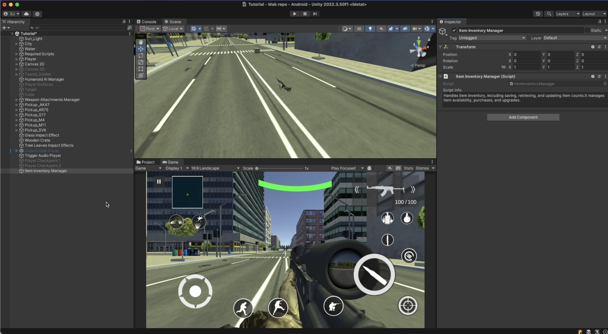
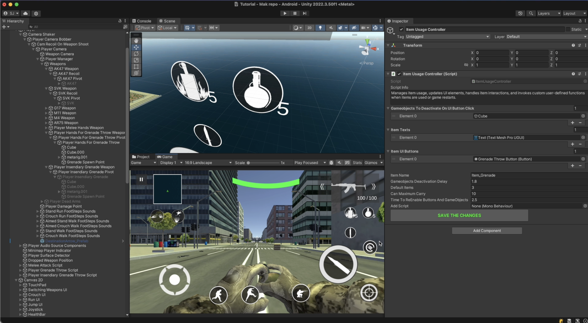

# Player Items Inventory

    <iframe width="700" height="405" src="https://www.youtube.com/embed/hVD0wtHb4UM?si=PUNwfF04UUhETk_2" title="YouTube video player" frameborder="0" allow="accelerometer; autoplay; clipboard-write; encrypted-media; gyroscope; picture-in-picture; web-share" referrerpolicy="strict-origin-when-cross-origin" allowfullscreen></iframe>

## Introduction
This video will guide you on how to setup the limited items for the player.

### Setting up the Items
Step 1: Create an empty gameObject
Step 2: Add a component called 'ItemsManager'
Step 3: Create another empty gameObject and add a component 'ItemsUsageController' Script.

Assign the necessary gameObjects and components like shown in the video above. Your setup should look like this [See the image below].

### Items Manager
Handles item inventory, including saving, retrieving, and updating item counts.It manages item availability, purchases, and upgrades.

### Items Usage Controller
Manages item usage, updates UI elements, handles item interactions, and invokes custom user-defined functions when items are used or game restarts.

<table class="custom-table">
<tr>
<th>Fields</th>
<th>Info</th>
</tr>
<tr>
<td>ItemName</td>
<td>A Unique name To Save The Item Data</td>
</tr>
<tr>
<td>GameobjectsToDeactivateOnUIButtonClick</td>
<td>Drag and Drop The Objects Which you want to deactivate After Each Use. For example: Grenades</td>
</tr>
<tr>
<td>GameobjectsDeactivationDelay</td>
<td>A Timer For Deactivating Objects</td>
</tr>
<tr>
<td>ItemTexts</td>
<td>Item Text To be Updated Each Time Item is Being Used. For example: If you use 1 grenade out of 3 grenades, the text will show 2 grenades</td>
</tr>
<tr>
<td>DefaultItems</td>
<td>Number of items player carries each time the level launches</td>
</tr>
<tr>
<td>CanMaximumCarry</td>
<td>Number of items player can maximum carry in Level</td>
</tr>
<tr>
<td>ItemUIButtons</td>
<td>UI Buttons associated with the item</td>
</tr>
<tr>
<td>TimeToReEnableButtons</td>
<td>Time delay before UI buttons are enabled</td>
</tr>
<tr>
<td>AddScript</td>
<td>Field to call a custom function</td>
</tr>
</table>

### Items Usage Controller
This script modifies the assigned MonoBehaviour by injecting additional code into the selected function. The item's usage is reduced only when the selected function is called.

<table class="custom-table">
<tr>
<th>Fields</th>
<th>Info</th>
</tr>
<tr>
<td>targetScript</td>
<td>Drag and drop the script that contains the function you want to modify.</td>
</tr>
<tr>
<td>selectedMethod</td>
<td>Enter the name of the function that should trigger item usage reduction.</td>
</tr>
<tr>
<td>itemUsageController</td>
<td>Drag and drop the ItemUsageController GameObject here to manage item usage.</td>
</tr>
</table>

