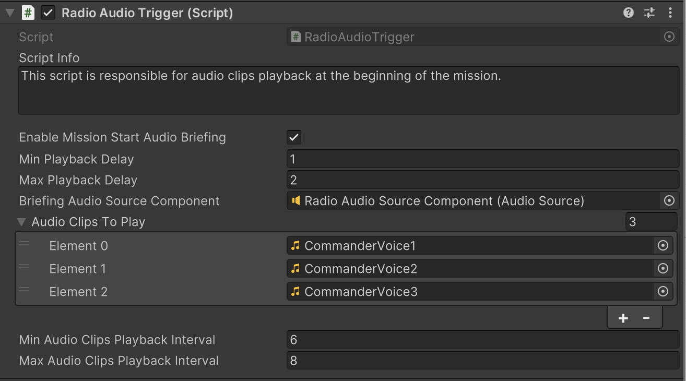
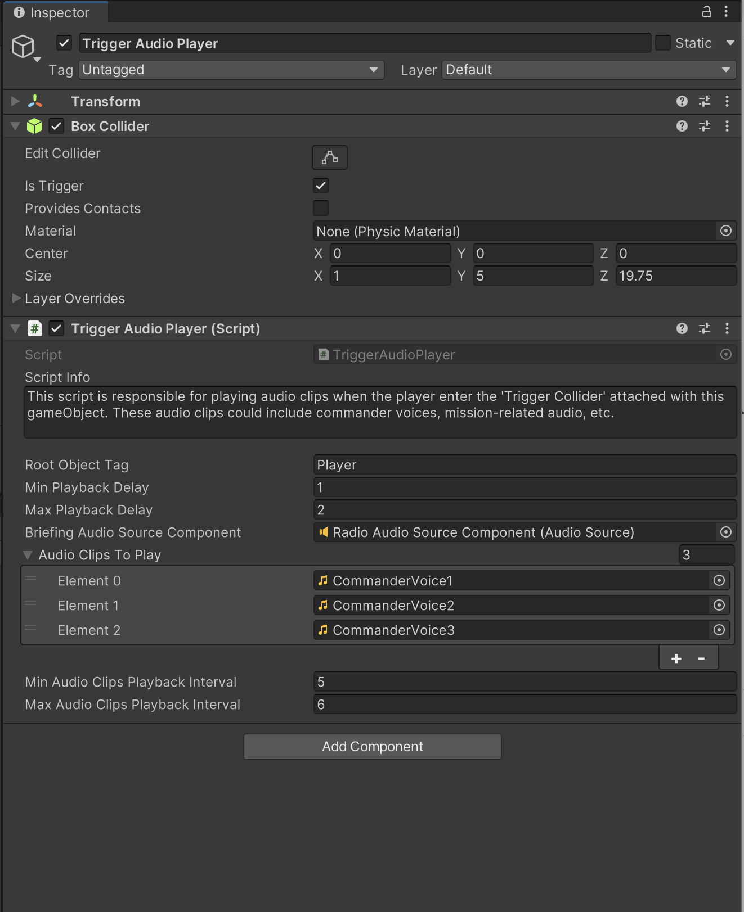

# Mission Briefing Audio Player

    <iframe width="700" height="405" src="https://www.youtube.com/embed/hVD0wtHb4UM?si=PUNwfF04UUhETk_2" title="YouTube video player" frameborder="0" allow="accelerometer; autoplay; clipboard-write; encrypted-media; gyroscope; picture-in-picture; web-share" referrerpolicy="strict-origin-when-cross-origin" allowfullscreen></iframe>

## Introduction
This video will guide you on how to setup the player mission briefing audio player.

### Radio Audio Trigger
First,Select the Player and add component called 'Radio Audio Trigger'. This script is responsible for audio clips playback at the beginning of the mission.

<table class="custom-table">
<tr>
<th>Fields</th>
<th>Info</th>
</tr>
<tr>
<td>EnableMissionStartAudioBriefing</td>
<td>If checked, audio clips will start playing when the game begins.</td>
</tr>
<tr>
<td>MinPlaybackDelay</td>
<td>Minimum delay (in seconds) before playing the first assigned audio clip.</td>
</tr>
<tr>
<td>MaxPlaybackDelay</td>
<td>Maximum delay (in seconds) before playing the first assigned audio clip.</td>
</tr>
<tr>
<td>BriefingAudioSourceComponent</td>
<td>Drag and drop the AudioSource component from the player hierarchy into this field.</td>
</tr>
<tr>
<td>AudioClipsToPlay</td>
<td>Drag and drop one or more audio clips from the project into this field.</td>
</tr>
<tr>
<td>MinAudioClipsPlaybackInterval</td>
<td>Minimum time (in seconds) between playing each audio clip.</td>
</tr>
<tr>
<td>MaxAudioClipsPlaybackInterval</td>
<td>Maximum time (in seconds) between playing each audio clip.</td>
</tr>
</table>

### Trigger Audio Trigger
This script is responsible for playing audio clips when the player enter the 'Trigger Collider' attached with this gameObject. These audio clips could include commander voices, mission-related audio, etc.

<table class="custom-table">
<tr>
<th>Fields</th>
<th>Info</th>
</tr>
<tr>
<td>RootObjectTag</td>
<td>Enter the root gameobject tag name to detect collision with before playing back assigned audio clips.</td>
</tr>
<tr>
<td>MinPlaybackDelay</td>
<td>Minimum delay (in seconds) before playing the first assigned audio clip.</td>
</tr>
<tr>
<td>MaxPlaybackDelay</td>
<td>Maximum delay (in seconds) before playing the first assigned audio clip.</td>
</tr>
<tr>
<td>BriefingAudioSourceComponent</td>
<td>Drag and drop the AudioSource component from the player hierarchy into this field.</td>
</tr>
<tr>
<td>AudioClipsToPlay</td>
<td>Drag and drop one or more audio clips from the project into this field.</td>
</tr>
<tr>
<td>MinAudioClipsPlaybackInterval</td>
<td>Minimum time (in seconds) between playing each audio clip.</td>
</tr>
<tr>
<td>MaxAudioClipsPlaybackInterval</td>
<td>Maximum time (in seconds) between playing each audio clip.</td>
</tr>
</table>
