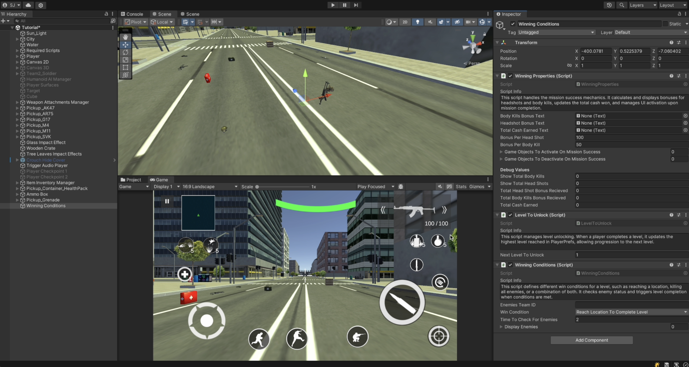

# Winning Conditions

    <iframe width="700" height="405" src="https://www.youtube.com/embed/hVD0wtHb4UM?si=PUNwfF04UUhETk_2" title="YouTube video player" frameborder="0" allow="accelerometer; autoplay; clipboard-write; encrypted-media; gyroscope; picture-in-picture; web-share" referrerpolicy="strict-origin-when-cross-origin" allowfullscreen></iframe>

## Introduction
This video will help you understand how to setup winning conditions for the player.

### How to setup 
Create an empty gameObject and Add a scipt called 'Winning Conditons'. This will automatically add 2 more additional scripts named as 'Winning Properties' and 'LevelToUnlock'

!!! note
    When selecting the win condition options **"Reach Location to Complete Level"** or **"Reach Location and Kill All Enemies"**,  
    you must add a **Box Collider** to the designated area and ensure the **"Is Trigger"** checkbox is enabled.

### Winning Properties
This script handles the mission success mechanics. It calculates and displays bonuses for headshots and body kills, updates the total cash won, and manages UI activation upon mission completion.

<table class="custom-table">
<tr>
<th>Fields</th>
<th>Info</th>
</tr>
<tr>
<td>BodyKillsBonusText</td>
<td>UI text element displaying bonus earned from body kills.</td>
</tr>
<tr>
<td>HeadshotBonusText</td>
<td>UI text element displaying bonus earned from headshots.</td>
</tr>
<tr>
<td>TotalCashEarnedText</td>
<td>UI text element displaying total cash earned.</td>
</tr>
<tr>
<td>BonusPerHeadShot</td>
<td>Bonus amount awarded per headshot.</td>
</tr>
<tr>
<td>BonusPerBodyKill</td>
<td>Bonus amount awarded per body kill.</td>
</tr>
<tr>
<td>GameObjectsToActivateOnMissionSuccess</td>
<td>GameObjects to activate when the mission is successfully completed.</td>
</tr>
<tr>
<td>GameObjectsToDeactivateOnMissionSuccess</td>
<td>GameObjects to deactivate when the mission is successfully completed.</td>
</tr>
<tr>
<td>ShowTotalBodyKills</td>
<td>Number of body kills in the current mission.</td>
</tr>
<tr>
<td>ShowTotalHeadShots</td>
<td>Number of headshots in the current mission.</td>
</tr>
<tr>
<td>TotatHeadShotBonusRecieved</td>
<td>Total bonus earned from headshots.</td>
</tr>
<tr>
<td>TotalBodyKillsBonusRecieved</td>
<td>Total bonus earned from body kills.</td>
</tr>
<tr>
<td>TotalCashEarned</td>
<td>Total cash won in the mission.</td>
</tr>
</table>

### Level To Unlock
This script manages level unlocking. When a player completes a level, it updates the highest level reached in PlayerPrefs, allowing progression to the next level.

<table class="custom-table">
<tr>
<th>Fields</th>
<th>Info</th>
</tr>
<tr>
<td>NextLevelToUnlock</td>
<td>The next level that should be unlocked upon completion of the current level.</td>
</tr>
</table>

### Winning Conditions
This script defines different win conditions for a level, such as reaching a location, killing all enemies, or a combination of both. It checks enemy status and triggers level completion when conditions are met.

<table class="custom-table">
<tr>
<th>Fields</th>
<th>Info</th>
</tr>
<tr>
<td>EnemiesTeamID</td>
<td>The team ID of the enemies that must be eliminated to win the level.</td>
</tr>
<tr>
<td>WinCondition</td>
<td>Defines the win condition for this level.</td>
</tr>
<tr>
<td>TimeToCheckForEnemies</td>
<td>Time interval (in seconds) for checking if all enemies are eliminated.</td>
</tr>
<tr>
<td>DisplayEnemies</td>
<td>List of enemy targets currently active in the scene.</td>
</tr>
</table>
